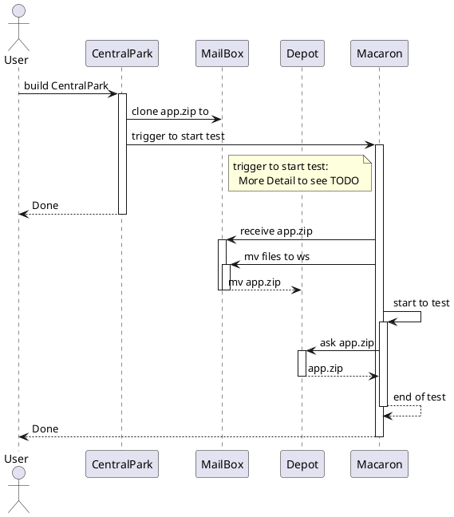
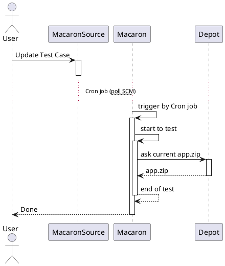

# Macaron Prototype

## Target

當一般 app / sdk 專案完成建置後，觸發 Macaron 做整合測試。

There are two types of trigger source.
1. After building new app or sdk
2. When Macaron test script has been updated

### example
1. Manually build `FakeSDKServerBuilder`
    You can see the `FakeSDKServerBuilder` creates a build and then `MacaronPrototype` also creates a build.

## Relation
1. After building new app or sdk


2. When Macaron test script has been updated


## How to use

0. Prepare:
    1. (TBD) clone Macaron Repo for specific Project
    2. clone this Jenkinsfile at the root of this repository
    3. modify the content of Jenkinsfile
        ```
        def mailBox = "/Users/jenkins/Documents/SDKServerMailBox"
        def testingBox = "/Users/jenkins/Documents/SDKServerTesting"
        def mailedAppName = "app.zip"
        def tempAppName = "receive.app.zip"
        def testAppName = "current.app.zip"
        ```
        to define the specific value for these 5 variables.
        **Warning**: the directory needs to be created at first manually.
    4. replace correct shell script at `stage("cooked by Macaron")`

1. create a new Job
    1. Enter an item name. e.g. `Macaron_CentralPark`
    2. select `Pipeline`

2. select the tab `Pipeline`
    1. Definition: `Pipeline script from SCM`
    2. SCM: `Git`
    3. Repositories.URL: `<the URL of Macaron Project>`
    4. Repositories.Credientials: `<select one of them>`
    5. (option) Branches to build: `<it depends on which specific branch you uses.>`

## TODO
`trigger to start test`: 是直接利用 pipeline 的命令去叫 Macaron 起來，未來區要再研究一下怎麼達到 file detect 的 cron job
- 目前第三方的 plug-in 有點太舊了，還需要研究一下用法
- 如果直接利用 Jenkinsfile 做檔案檢查，會導致產生過多只有檢查的 build
